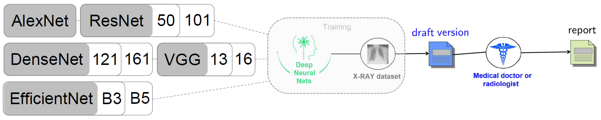

---

##### Download

+ [Paper](paper2.pdf)

---

##### Abstract

Diagnostic Captioning is described as the automatic text generation from a collection of X-RAY images
and it can assist inexperienced doctors and radiologists to reduce clinical errors or help experienced
professionals to increase their productivity. Therefore, tools that would help doctors and radiologists
produce higher quality reports in less time could be of high interest for medical imaging departments, as
well as significantly impact deep learning research within the biomedical domain. With our participation
in ImageCLEFmedical 2022 Caption evaluation campaign, we have attempted to address both concept
detection and caption prediction tasks by developing baselines based on Deep Neural Networks; including
image encoders, classifiers and text generators. Our group, NeuralDynamicsLab at KTH Royal Institute of
Technology, within the school of Electrical Engineering and Computer Science, ranked 4th in the former
and 5th in the latter task.

---

##### Figure: Overview of our architecture



---

##### Citation

G. Moschovis, E. Fransén, Neuraldynamicslab at imageclef medical 2022, in: CLEF2022
Working Notes, CEUR Workshop Proceedings, CEUR-WS.org, Bologna, Italy, 2022. https://ceur-ws.org/Vol-3180/paper-112.pdf.

```BibTeX
@inproceedings{moschovis2022,
author = {Moschovis, Georgios and Fransén, Erik},
title = {NeuralDynamicsLab at ImageCLEF Medical 2022},
booktitle = {CLEF2022 Working Notes},
series = {{CEUR} Workshop Proceedings},
year = {2022},
volume = {},
publisher = {CEUR-WS.org },
pages = {},
month = {September 5-8},
address = {Bologna, Italy}
}
```

---

##### Related material

+ [Poster presentation](poster_camera_ready_90_180.pdf)
+ [My master thesis; extending the work of this paper](Thesis_Moschovis_Georgios-v6.pdf)

