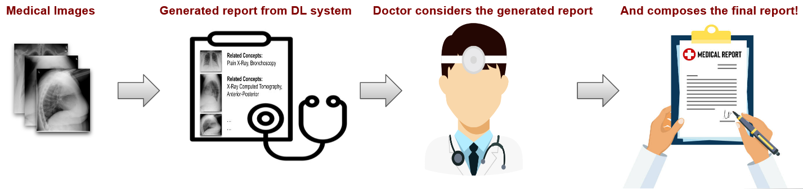

---

##### Download

+ [Paper](paper3.pdf)

---

##### Abstract

This article describes the methods that the AUEB NLP Group experimented with during its participation
in the 7th edition of the ImageCLEFmedical Caption sub-tasks, namely Concept Detection and Caption
Prediction. The former intends to automatically classify biomedical images into a set of one or more tags
based solely on the visual input, while the latter aims to generate a syntactically and semantically accurate
diagnostic caption that addresses the medical conditions depicted on a given image. For the Concept
Detection sub-task, extending our previous work, we utilized a wide range of Convolutional Neural
Network encoders followed by a Feed-Forward Neural Network, both in a single-task and a multi-task
fashion, as well as combined with a contrastive learning approach. Our methods concerning the Caption
Prediction sub-task are influenced by both our previous work and recent progress in Natural Language
Processing (NLP) methods. Our two base systems use CNN-RNN and Transformer-to-Transformer
encoder-decoder architectures, respectively. Additionally, we experimented with a Transformer-based
denoising component, which was trained to reformulate the generated captions in a more syntactically
coherent and medically accurate way. Our group ranked 1st in Concept Detection and 3rd in Caption
Prediction.

---

##### Figure: Overview of our architecture



---

##### Citation
P. Kaliosis, G. Moschovis, F. Charalampakos, J. Pavlopoulos, I. Androutsopoulos, “AUEB NLP Group at ImageCLEFmedical Caption 2023”, in: CLEF2023  Working Notes, CEUR Workshop Proceedings, CEUR-WS.org, Thessaloniki, Greece, 2023. https://ceur-ws.org/Vol-3497/paper-126.pdf

```BibTeX
@inproceedings{Kaliosis2023AUEBNG,
  title={AUEB NLP Group at ImageCLEFmedical Caption 2023},
  author={P. Kaliosis and G. Moschovis and F. Charalampakos and J. Pavlopoulos and I. Androutsopoulos},
  booktitle={Conference and Labs of the Evaluation Forum},
  year={2023}
}
```

---